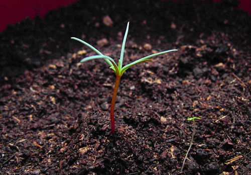
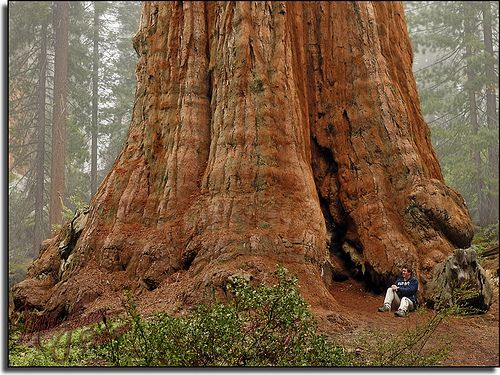

# Floodgate Outliers
## Alumni Community Operating Manual
### Introduction
Floodgate has invested a massive amount of time, energy, resources, and belief into
starting this community, and for that, we're all immensely grateful.
But a community is only as strong as the effort put in by each member -- it's now
up to us to water the seeds Floodgate planted to grow this community into the
redwoods each of us trapezed across.

---
*Outliers today*

---
*Outliers tomorrow*

Our effort will be especially important as the community grows -- Tyler only has
so many sleepless nights him in, and Jacob's sure to get sick of us at some
point ;)

This is a first and very rough draft of what it means to be apart of the Outliers
community, a definition which all members, present and future, will play
a critical role in defining.

### Principles
Members of Outliers all share a common trait -- we're technical students
aiming to start companies to solve generational problems. However, a strong community cannot be built
only around shared aspirations. Instead, we also need to share values,
principles around which we're all aligned that form the ethos of our community.

Below is a proposal for our principles, most of which were defined at the
beginning of the program when we first met.

1. Be optimistic
2. Actively communicate
3. Be open to new ideas and disagreements
4. Be the person in the arena
5. Keep accountable, maintain consistency
6. Invest in each other -- give before you take
7. Be curious -- have an insatiable love for learning
8. Live in the future, then build what's missing
9. Lean into the unknown

These values and what they mean to us should change with time, as we bring
in new members, and as we discover what's important to us as a group.

### Short term expectations
In the short term, there's a lot of work to be done to scale the Outliers
program, and we're all selfishly incentivized to ensure its strength (I
personally want to continue to meet people smarter than me). Floodgate is a
mighty, but small team, and we need to pitch in to help push forward their
vision.

The first priority will be bringing on the next Outliers cohort. A lot goes into
this, including:

- Building the Outliers landing page
- Marketing the program -- running a campaign, referring friends, and finding
  outlets beyond our personal networks to bring in a wide array of Outliers --
  smart, talented, and holding different perspectives.
- Reviewing applications and interviewing members -- we all should pitch in to
  help lighten the load on the Floodgate team for reviewing applications and
  interviewing
- Curriculum design -- the current curriculum is filled with valuable
  teachings around VCs, industry exploration, and the non-technical part of
  building a company. As Tyler's brought up, it lacked a technical building
  component, and we can contribute meaningfully by designing projects that can
  help new members to grow technically
- "Mentor" new cohorts -- while we may not be near near mentor material (original author of this especially), pairing with
  new members will cultivate cross-cohort relationships that will build a
  tightly-knit long-term community

Nobody needs to contribute to everything, and we're all exceptionally busy,
but this program will only thrive if we all invest energy to make it better.

### Medium term plans
Although we collectively have a lot of work to do to scale this program, being
an alum doesn't just mean working. A big part of the strength of this community
will be determined by the fun we have together going forward. The retreat was a
great start, and we should keep this energy going. We should continue to meet
up, host events, and learn and grow together. Floodgate will be able to help
through a lot of this -- if we want to hear from a speaker, do a deep dive into
an industry, skill or topic, host a hackathon, collectively take on an ambitious
project, or annually host retreats, they'll be there. But a lot will come organically
from each other. We'll be living in or traveling to similar places, thinking about similar
topics, and reading similar books -- finding time to connect over these will be
important.

More generally, it'd be incrdedible to see this community become a vibrant support network,
where we look to learn, grow, colab, have fun, and get hyped up. Everyone should
be able to look to each other to ask for help without hesitiation, and all of us
should be on on the lookout to offer support.

We should also continue to show our lovely faces on the monthly Outlier's
newsletter -- it's priceless to see what everyone is thinking about :)

### Long term visions
Beyond short term expectations and our medium term plans to stay connected, what
this community becomes is up to all of us. Do we revamp DAOutliers?
Might our yearly retreats end up on an island we collectively purchase with
$OUTLIER? Is there an Outliers Angel Syndicate
where we all invest into each others projects? Do countless ~~unicorns~~ thunder
lizards hatch from atomic eggs incubated by Outlier co-founders? Only time and
the effort we put into shaping this community will tell, and we should all dream
up the potential together.

### Tools and Resources
For now, the community tooling consists of our Notion and Discord.
- [Notion](https://www.notion.so/floodgateoutliers/Community-a36be87df38c486e8ff06812648ba4b4)
- [Discord](https://discord.gg/hk5JB2EY)
